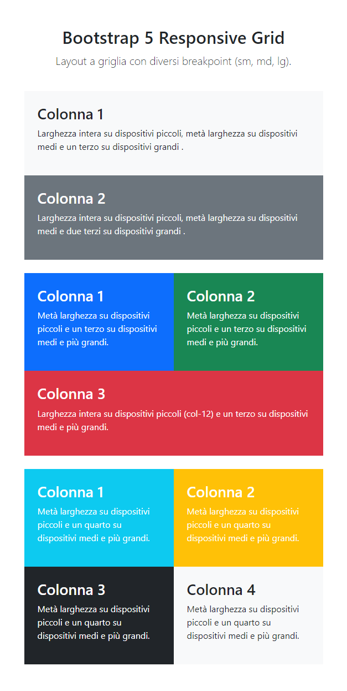

# HTML-CSS-BOOSTRAP-LAYOUT

Web page responsive layout built using Boostrap 5 framework frontend.

# Demo Live

[🌐  **Click here for demo**](https://daviderocco85.github.io/htmlcss-boostrap-layout/)

# Target

Recreate a layout with a responsive grid using Bootstrap 5 based on the available space across different devices.

# HTML-CSS-BOOSTRAP-LAYOUT screenshot example
#### Mobile

#### Tablet

#### Desktop

